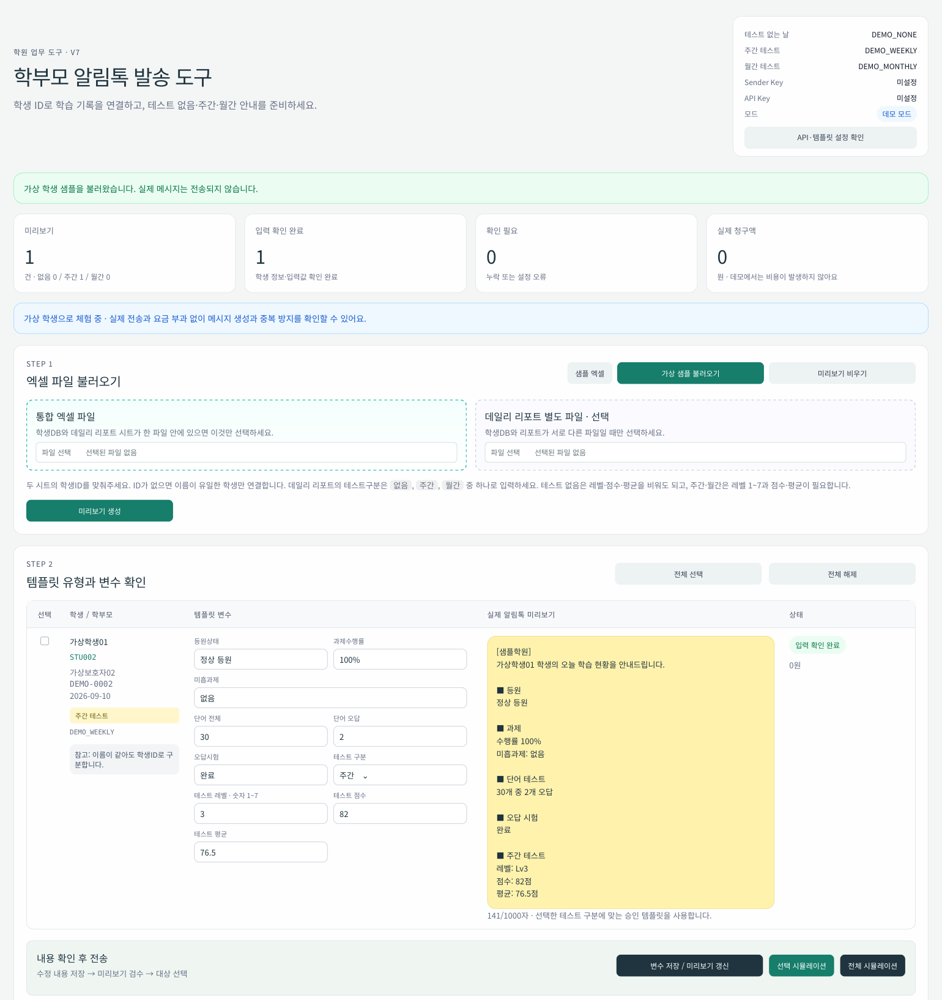

# 학부모 알림톡 업무 자동화

학원에서 매일 반복하던 학생별 학습 안내를 **엑셀 입력 → 학생별 메시지 생성 → 미리보기·수정 → 일괄 알림톡 발송**으로 연결한 업무 자동화 프로젝트입니다.

원장님의 실제 요청에서 시작해 문자 발송 방식의 비용 문제를 발견하고, **카카오 알림톡 API 방식으로 전환**했으며, 운영 피드백을 반영해 **테스트 없음·주간·월간 3종 안내 흐름**까지 확장했습니다.

300명 규모 학원에서 기존 장문 문자 방식 대비 월 발송 비용을 **233,100원 → 58,500원**, 약 **74.9%(약 75%) 절감**했습니다. 현재 실제 학원 업무에 사용되고 있으며, 운영자로부터 기존보다 훨씬 편하게 사용하고 있다는 피드백을 받았습니다.

이 저장소에는 개인정보를 제거하고 입력 검증·중복 발송 방지·데모 모드·회귀 검사를 보강한 공개용 **v7**을 담았습니다.

## 프로젝트가 시작된 이유

원장님께서 다음과 같은 문제를 이야기하셨습니다.

> 매일 약 300명의 학부모에게 학생마다 다른 내용의 메시지를 복사·붙여넣기해서 보내는 일이 너무 번거롭고 오래 걸린다.

처음에는 **필요한 값만 입력하면 학생별 메시지를 만들고 한 번에 발송할 수 있는 기능**을 만드는 것을 목표로 잡았습니다.

직접 메시지를 전송하는 방식은 사용할 수 없어 외부 메시지 발송 API가 필요했고, 먼저 요구한 안내 양식에 맞춰 문자 발송 방식으로 구현했습니다. 하지만 안내 내용이 장문으로 처리되면서 비용이 예상보다 높아졌습니다.

그래서 대체 수단을 다시 조사했고, 카카오 비즈니스 메시지와 알리고 알림톡 API를 이용하면 같은 업무 흐름을 더 낮은 비용으로 운영할 수 있다는 것을 확인했습니다. 카카오 비즈니스 채널과 승인 템플릿을 준비하고 알림톡 발송 방식으로 전환했습니다.

이후 실제 사용자 피드백 과정에서 학습 안내가 하나의 형식만 있는 것이 아니라 **테스트가 없는 날, 주간 테스트가 있는 날, 월간 테스트가 있는 날**의 3가지 경우로 나뉜다는 요구사항을 추가로 확인했습니다. 이를 반영해 유형별 템플릿을 자동 선택하도록 수정한 뒤 최종 운영본을 전달했습니다.

즉, 이 프로젝트는 처음부터 정해진 기능을 구현한 것이 아니라 **사용자 문제 파악 → 1차 구현 → 비용 문제 발견 → 발송 방식 변경 → 실제 피드백 → 3종 운영 규칙 반영**의 과정을 거쳐 발전했습니다.

## 비용 개선

하루 300명에게 30일 동안 발송한다고 가정하면 한 달 발송량은 **9,000건**입니다.

| 방식 | 건당 비용 | 300명 × 30일 | 월 비용 |
|---|---:|---:|---:|
| 기존 장문 문자 | 25.9원 | 9,000건 | **233,100원** |
| 카카오 알림톡 | 6.5원 | 9,000건 | **58,500원** |
| 차이 |  |  | **174,600원 절감** |

`(233,100 - 58,500) / 233,100 × 100 = 약 74.9%`

따라서 동일한 발송량 기준으로 **월 메시지 발송 비용을 약 75% 절감**할 수 있었습니다.

## 해결 방법

학생 정보와 학습 기록을 엑셀에서 읽고 학생별 메시지를 자동 생성합니다. **테스트 없음·주간·월간**에 맞춰 승인된 알림톡 템플릿을 선택하고, 운영자가 화면에서 내용을 확인하고 수정한 뒤 선택 또는 전체 발송합니다.

메시지 전달에는 알리고의 카카오 알림톡 API를 사용합니다. 실제 사용자가 Windows PC와 Excel을 중심으로 업무를 처리하기 때문에 별도의 클라우드 서버 대신 **Windows에서 실행하는 로컬 웹 프로그램**으로 구성했습니다.

## 주요 기능

| 기능 | 동작 |
|---|---|
| 엑셀 불러오기 | 학생DB와 데일리 리포트를 통합 파일 또는 별도 파일로 읽습니다. |
| 학생 연결 | 학생ID로 연결하고 이름을 교차 확인합니다. ID 없는 동명이인은 확인 대상으로 남깁니다. |
| 3종 메시지 생성 | 테스트 없음·주간·월간에 따라 본문과 변수를 구성합니다. |
| 미리보기·수정 | 등원, 과제, 단어 수, 테스트 결과를 수정하고 최종 본문을 확인합니다. |
| 입력 오류 확인 | 날짜·전화번호·퍼센트·개수·점수의 누락과 잘못된 범위를 확인합니다. |
| 선택·전체 발송 | 대상 행을 선택하거나 입력 확인이 끝난 전체 행을 요청합니다. |
| 중복 요청 방지 | SQLite에 발송 이력을 남겨 같은 요청의 반복 전송을 막습니다. |
| 본인 번호 테스트 | 유형별로 본인 휴대전화의 실제 수신을 확인한 후 일반 발송을 진행합니다. |
| 결과 기록 | API 요청 결과를 CSV로 남깁니다. 요청 접수와 실제 수신은 구분합니다. |
| 데모 모드 | 가상 학생 12명으로 외부 API 호출과 요금 부과 없이 체험합니다. |

<details>
<summary>가상 데이터로 만든 화면 예시 보기</summary>



실제 Flask 화면 템플릿을 정적으로 렌더링한 이미지입니다. 브라우저에서의 폼 모양·간격은 다를 수 있습니다. [3종 메시지 전체 화면](docs/aligo_v7_full_preview.png)도 확인할 수 있습니다.

</details>

## 기술 스택

| 영역 | 기술 | 사용 목적 |
|---|---|---|
| 실행 환경 | Python 3.10+, Windows | 로컬 프로그램 실행 |
| 웹 화면 | Flask, Jinja2, HTML, CSS, JavaScript | 파일 업로드, 메시지 수정, 발송 화면 |
| 엑셀 처리 | openpyxl | 시트 읽기와 셀 값·서식 해석 |
| 메시지 연동 | requests, 알리고 알림톡 API | 인증과 템플릿별 발송 요청 |
| 요청 이력 | SQLite | 원자적 예약과 중복 요청 확인 |
| 설정 | python-dotenv | API 키와 실행 모드 관리 |
| 검증 | unittest, unittest.mock | 입력·발송 흐름의 회귀 검사 |

## 내가 한 판단과 개선 과정

### 1. 사용자 문제를 기능으로 바꾸기

단순히 메시지를 자동 생성하는 데서 끝내지 않고 실제 사용자의 업무 순서를 기준으로 **엑셀 입력 → 자동 생성 → 사람이 미리보기로 검수 → 선택·전체 발송 → 결과 기록** 흐름을 구성했습니다.

### 2. 문자 방식의 비용 문제를 발견하고 알림톡으로 전환

첫 구현은 문자 발송을 기준으로 만들었지만, 실제 안내 양식이 장문으로 처리되면서 300명 규모에서 비용 부담이 커졌습니다. 기능 구현 후에도 운영비를 다시 검토해 카카오 비즈니스 알림톡을 대안으로 찾았고, 승인 템플릿 등록과 API 연동까지 진행해 월 발송 비용을 약 75% 낮췄습니다.

### 3. 피드백으로 1종 메시지를 3종 운영 규칙으로 확장

최초 요구만으로는 알 수 없었던 **테스트 없음·주간 테스트·월간 테스트**의 차이를 실제 사용자 피드백에서 확인했습니다. 테스트 유형에 맞춰 서로 다른 승인 템플릿과 변수를 사용하도록 수정해 학원의 실제 운영 방식에 맞췄습니다.

### 4. 발송 전 사람이 확인하는 단계 유지

학생별 내용은 실제 학부모에게 전달되므로 완전 자동 발송보다 **자동 생성 후 운영자가 직접 확인하고 수정하는 구조**를 선택했습니다. 수정 내용이 저장되지 않았거나 미리보기가 변경된 경우 바로 발송되지 않도록 보호합니다.

### 5. Windows 로컬 앱으로 구현

사용자가 실제로 Windows와 Excel 환경에서 업무를 처리하기 때문에 별도의 서버 운영 없이 사용할 수 있는 로컬 웹 프로그램으로 구성했습니다. 설치 및 실행 배치 파일을 제공해 비개발자도 정해진 순서로 실행할 수 있도록 했습니다.

### 6. 공개용 v7에서 운영 안정성 보강

| 발견한 문제 | 개선한 내용 | 판단 이유 |
|---|---|---|
| 이름만으로는 동명이인을 구분하기 어려움 | 학생ID 우선 연결, 이름 교차 확인, 모호한 행 차단 | 학습 내용과 수신자를 정확히 연결하기 위해 |
| 반복 클릭이나 재시도로 같은 메시지가 다시 요청될 수 있음 | 요청 전 SQLite 예약, 재시작 후에도 이력 유지 | 화면 버튼 제어만으로 중복 요청을 막기 어려워서 |
| 타임아웃 때 실제 발송 여부를 알 수 없음 | 확인 대기 상태로 보관하고 자동 재시도 차단 | 이미 접수된 메시지를 다시 보내는 일을 피하기 위해 |
| Excel의 90%가 내부적으로 0.9로 저장됨 | 숫자 값과 퍼센트 서식을 함께 해석 | 표시된 의미가 메시지에도 그대로 반영되도록 |
| 테스트 구분 누락·잘못된 점수 등이 메시지에 들어갈 수 있음 | 유형별 필수 항목과 값 범위 검증 | 발송 전에 오류를 발견하도록 |
| 운영 파일을 그대로 공유하면 개인정보가 포함됨 | 가상 샘플, 빈 설정 예시, 운영 파일 제외 규칙 제공 | 프로젝트를 안전하게 공개하기 위해 |

v7의 코드 개선과 회귀 검사에는 AI 코딩 도구를 활용했습니다. 요구사항 정의, 운영 흐름 선택, 사용자 피드백 반영, 비용 전환 판단과 실제 운영 확인은 프로젝트 진행 과정에서 직접 수행했습니다.

## 실행 방법

### 데모 실행

1. **Python 3.10 이상**을 설치합니다. Windows 설치 시 `Add python.exe to PATH`를 선택합니다.
2. 프로젝트 ZIP을 내려받아 완전히 압축 해제합니다.
3. `install_windows.bat`를 실행합니다. 최초 설치에는 패키지 다운로드를 위한 인터넷 연결이 필요합니다.
4. `start_demo.bat`를 실행합니다.
5. 브라우저의 `http://127.0.0.1:5050`에서 **가상 샘플 불러오기**를 누릅니다.

기본 모드는 실제 메시지를 보내지 않는 데모입니다. 가상 학생 12명의 메시지를 확인하고 선택·전체 시뮬레이션을 실행할 수 있습니다.

### 실제 운영

실제 발송에는 알리고 계정, 등록 발신번호, Sender Key, 승인 템플릿 3종과 본인 테스트 번호 설정이 필요합니다. [실행 및 운영 안내](docs/usage.md)의 설정·이관 순서를 따릅니다.

작성자가 **Windows 환경에서 프로그램 실행과 실제 알림톡 수신을 확인**했으며, 현재 학원 업무에서 실제 사용 중입니다.

## 검증

회귀 검사는 프로젝트 폴더에서 실행합니다.

```bash
python -m unittest discover -s tests -v
```

Linux/Python 환경에서 **29개 자동화 검사 통과**를 기록했습니다. 자동화 검사에서는 외부 API를 모의 응답으로 대체했으며, 별도로 작성자가 Windows 실행과 실제 알림톡 수신을 운영 환경에서 확인했습니다. [검증 기록](docs/verification.md)에 자동화 검사와 실제 운영 확인을 구분해 기록했습니다.

## 성과

| 항목 | 결과 |
|---|---|
| 적용 현장 | **300명 규모 학원**의 학부모 안내 업무 |
| 기존 월 발송비 | 장문 문자 25.9원 × 300명 × 30일 = **233,100원** |
| 변경 후 월 발송비 | 알림톡 6.5원 × 300명 × 30일 = **58,500원** |
| 비용 개선 | 월 **174,600원**, 약 **74.9%(약 75%) 절감** |
| 기능 개선 | 반복 복사·붙여넣기 업무를 엑셀 입력 기반 일괄 처리 흐름으로 전환 |
| 사용자 피드백 | 3종 테스트 유형 요구사항을 추가 반영했고, 최종본을 현재 편하게 사용 중이라는 피드백을 받음 |

300명은 프로그램의 동시 접속자 수가 아니라 실제 적용 학원의 재원생 규모입니다. 업무 시간 절감률은 별도 측정값이 없어 수치로 제시하지 않았습니다.

## 저장소 안내

- `app.py`: Flask 앱과 전체 업무 흐름
- `input_rules.py`: 입력값 정규화와 검증
- `delivery_store.py`: SQLite 기반 요청 예약과 중복 처리
- `samples/sample_students.xlsx`: 동명이인 예시를 포함한 가상 학생 12명
- `tests/test_sender.py`: 외부 API를 대체하는 회귀 검사
- `docs/`: 실행 안내, 검증 기록, 화면 자료

실제 API 키, 운영 엑셀, 학부모 연락처와 발송 로그는 포함하지 않습니다. 실행 후 생성되는 `runtime/`에는 운영 데이터가 저장되므로 버전 관리에서 제외합니다.
